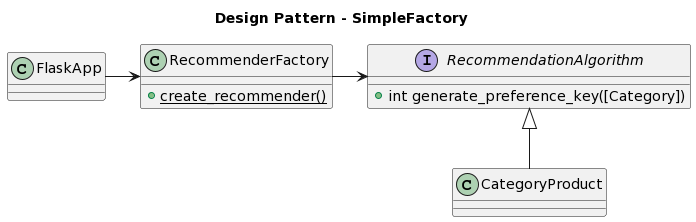
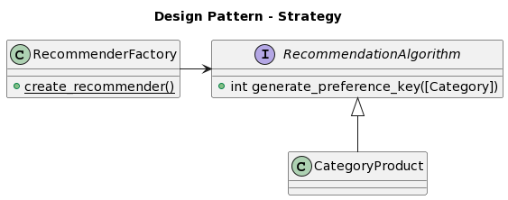

# Running the project

Project can be build using the following command:
`docker-compose build`

Project can be run using the following command:
`docker-compose –-env-file config/dev.env up app`

You can access the project using the following url:
http://localhost:5005/

# Testing

Project can be tested using the following command:
`docker-compose –-env-file config/test.env up test`

# Endpoints

> Note. All endpoints receive arguments using url parameters convention

## create_user

```
POST create_user(username, email, preferences)
```

Enpoint that registers a user and their preferences.

### Args

- `username`. The username of the user to get recommendations of
- `email`. A user's email address
- `preferences`. A user's top 3 preferred categories according to the following table:

Category | Value
------ | ------
Comedy      | 1
Drama       | 2
Sci-Fi      | 3
Romantic    | 4
Adventure   | 5

### Possible outcomes

- **Result code 200**: User created successfully
- **Result code 409**: User already exists

### Example

http://localhost:5005/create_user?username=dragon_lava&email=asdf@gmail.com&preferences=1&preferences=2&preferences=4

## get_recommendations

```
GET get_recommendations(username, descending)
```

Endpoint that gets movie recommendations (a maximum of 10 movies) to an already registered user based on their preferences in either ascendeing or descending order based on the movie's rating. 

### Args

- `username`. The username of the user to get recommendations of
- `descending` (Optional). If true, the movies return will be those with the highest rating. Otherwise it will be the ones with the lowest.

### Possible outcomes

- **Result code 200**: Returns the movies recommendations
- **Result code 400**: Missing a required argument
- **Result code 404**: User was not found 

### Example

http://localhost:5005/get_recommendations?username=asdf&descending=false

# Class Diagrams





